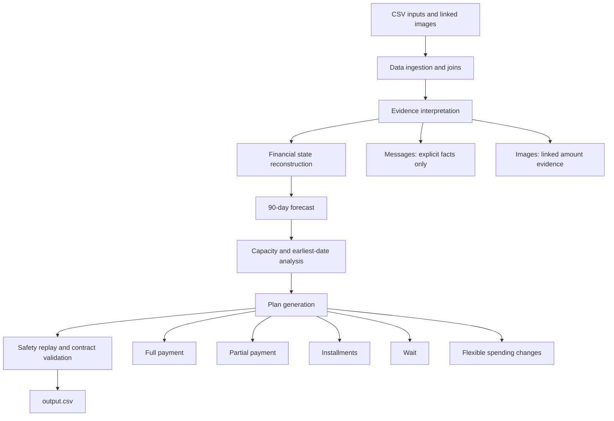

# HackerRank Orchestrate — Buy or Wait?

Deterministic financial affordability and payment-planning agent for the HackerRank Orchestrate September 2026 challenge.

The solution answers whether a user can safely complete each request in
`dataset/requests.csv` while preserving essential commitments and the user’s
preferred minimum balance. It produces the final prediction file at:

```text
output.csv
```

## Quick start

The solution uses Python 3.10+ standard-library modules only. No network
access, API key, model provider, or third-party package is required.

From the repository root:

```bash
python3 -m py_compile code/main.py
python3 code/main.py
```

The command reads the participant-facing files from `dataset/` and writes one
row per request to the root-level `output.csv`.

## Implemented architecture

The implementation separates financial arithmetic from evidence handling and
plan selection. Decimal arithmetic and deterministic rules remain authoritative
for all money and safety decisions.



### Pipeline stages

1. **Ingestion and joins**
   - Loads profiles, events, requests, payment options, exchange rates,
     messages, and image links.
   - Joins user-level data by `user_id`, request-level data by `request_id`,
     and evidence by `related_event_id`.

2. **Evidence interpretation**
   - Extracts explicit salary, invoice, employment, and rent-change facts from
     supported messages.
   - Uses the linked image amount for blank event amounts.
   - Treats messages and images as untrusted evidence; embedded instructions
     cannot override challenge rules.

3. **Financial reconstruction**
   - Uses `current_available_balance` as the opening balance on the request
     date.
   - Does not replay settled historical events because they are assumed to be
     reflected in the opening balance.
   - Reserves pending debits and scheduled debits.
   - Excludes pending credits, failed events, cancelled events, and unrealized
     investment valuations.
   - Counts confirmed credits on their settlement date.
   - Converts foreign-currency events using the supplied settlement-date rate.

4. **Forecasting**
   - Detects recurring streams from repeated settled history.
   - Supports monthly, weekly, and biweekly patterns.
   - Separates stable monthly streams when multiple recurring runs exist, such
     as two separate salary dates.
   - Forecasts recurring cash flows for 90 days from the request date.

5. **Plan generation**
   - Evaluates full payment, partial payment, supplied installments, waiting,
     and permitted flexible-spending changes.
   - Rejects plans that breach the minimum balance or miss the completion date.

6. **Validation and export**
   - Validates output columns, row coverage, amount bounds, installment schedule
     integrity, partial-payment reconciliation, and flexible-change eligibility.
   - Writes deterministic CSV output in the exact required column order.

## Hybrid financial strategy

The final implementation uses two forecast scopes because affordability capacity
and earliest safe date answer different questions.

### Capacity and affordability scope

For `amount_safe_to_pay`, `affordability_status`, and immediate plan safety, the
engine forecasts:

- Expense categories the user explicitly protects
- Recurring salary
- Explicit future pending/scheduled events of any relevant category
- Confirmed income extracted from messages

This prevents discretionary, unprotected recurring spending from making every
request appear unaffordable. It still protects the commitments the user has
marked as important and retains recurring income.

### Earliest-date scope

`earliest_date_for_full_payment` uses the full recurring forecast, including
unprotected recurring categories. This keeps the date estimate conservative and
independent of the user’s payment-method preferences.

### Why this strategy was selected

The original all-recurring-category strategy was too conservative on the
public examples. Controlled experiments produced the following results:

| Strategy | Status | Method | Plan | Earliest date | Changes | Total exact field matches |
|---|---:|---:|---:|---:|---:|---:|
| All recurring categories | 12/25 | 13/25 | 10/25 | 10/25 | 22/25 | 68/150 |
| Protected + salary capacity; full earliest-date forecast | **15/25** | **17/25** | **13/25** | **10/25** | **22/25** | **78/150** |

The hybrid strategy also moved the full-dataset `not_affordable` share from
approximately 55% to approximately 36%, closer to the 32% observed in the
solved examples.

The strategy is calibrated only against the public examples and remains
deterministic. It does not use expected evaluation labels during inference.

## Financial rules implemented

### Event lifecycle

| Event state | Treatment |
|---|---|
| `settled` before request date | Assumed included in opening balance; used as history |
| `settled` after request date | Included as known future cash flow |
| `pending` debit | Reserved at settlement date |
| `pending` credit | Ignored until settled |
| `scheduled` debit | Reserved at settlement date |
| `scheduled` credit | Counted at settlement date |
| `failed` | Excluded unless separately represented by valid evidence |
| `cancelled` | Excluded |
| `unrealized` / `non_cash` | Never treated as spendable cash |

### Currency conversion

- Balances and request amounts are interpreted in the user’s home currency.
- Foreign-currency event amounts are converted with the supplied rate for the
  event settlement date and currency direction.
- If an exact rate is unavailable, the implementation uses the latest prior
  supplied rate as a defensive fallback.

### Recurrence

- Recurrence requires repeated historical evidence.
- Monthly streams may be split by stable day-of-month patterns.
- Variable recurring values use recent historical values; fixed obligations use
  recent conservative values.
- Salary continuation is retained because the public examples demonstrate that
  recurring income is expected to continue when history supports it.

### Messages and images

Relevant explicit message facts may clarify:

- Salary amount or salary date
- Confirmed invoice income
- Employment ending
- Temporary salary changes
- Rent increases

Pending refunds, bonuses, commissions, prizes, investment valuations, and other
unsettled or unapproved credits are not treated as available cash.

Blank event amounts are resolved through the linked image evidence. The supplied
16-image dataset is supported with deterministic local evidence values so the
solution remains dependency-free and runnable without OCR libraries.

## Payment planning

### Full payment

Selected when:

- The user accepts `full_payment`
- The complete request is safe on the request date
- The full forecast remains at or above the minimum balance

### Partial payment

Selected only when:

- The request allows partial payment
- The user accepts `partial_payment`
- The safe amount is greater than zero and less than the requested amount
- The remainder can be paid by `desired_completion_date`

The plan always contains exactly two payments:

```text
request_date:amount_safe_to_pay|earliest_date_for_full_payment:remaining_amount
```

### Installments

Installment plans must:

- Come from `request_payment_options.csv`
- Be accepted by the user profile
- Be within `max_installment_months`
- Finish by `desired_completion_date`
- Match the supplied payment amount and dates exactly
- Pass the chronological minimum-balance replay

### Wait

Waiting is eligible when:

- The user accepts `full_payment`
- Full payment is not safe immediately
- A safe full-payment date exists within the request deadline

### Flexible-spending changes

Only recurring events that are:

- Not in a protected category
- Marked `stoppable`, `reducible`, or `reducible_or_stoppable`
- In a category the user explicitly permits stopping or reducing

may be changed. At most three changes are serialized as:

```text
stop:<event_id>
reduce_to:<event_id>:<new_amount>
```

## Output contract

`output.csv` contains exactly these columns, in this order:

```text
request_id,amount_safe_to_pay,affordability_status,recommended_payment_method,payment_plan,earliest_date_for_full_payment,spending_changes_needed,decision_explanation
```

Allowed statuses:

- `affordable_now`
- `affordable_with_plan`
- `affordable_later`
- `not_affordable`

Allowed methods:

- `full_payment`
- `partial_payment`
- `installments`
- `wait`
- `not_recommended`

The implementation enforces:

```text
0 <= amount_safe_to_pay <= requested_amount
```

## Validation and reproducibility

The final run was checked for:

- 250 output rows for 250 evaluation requests
- Exact output columns and ordering
- Valid status and payment-method values
- Safe-amount bounds
- Chronological payment plans
- Installment plans matching supplied options
- Partial-payment plans adding exactly to the requested amount
- Spending changes targeting eligible flexible events
- Minimum-balance safety replay for every recommended plan

Run the generator again with:

```bash
python3 code/main.py
```

The implementation is deterministic for the supplied dataset and does not make
network or model-provider calls.

## Repository layout

```text
.
├── AGENTS.md
├── README.md
├── problem_statement.md
├── code/
│   ├── main.py                         # Runnable decision engine
│   ├── README.md                       # Short implementation guide
│   └── evaluation/
│       ├── main.py
│       └── usage_report.md             # Final token/cost report
├── dataset/                            # Participant-facing input data
├── output.csv                          # Generated predictions
├── code.zip                            # Submission package
└── log.txt                             # Required chat transcript
```

The input files under `dataset/` are not modified by the generator.

## Known limitations and assumptions

1. **Forecast-policy uncertainty** — the public examples do not fully specify
   the organizer’s exact variable-spending and reserve policy. Safe-amount
   accuracy remains weaker than method and plan validity.
2. **Image extraction** — the supplied image evidence is resolved with local
   deterministic values rather than a general OCR pipeline. New image sets
   would require an OCR integration or updated evidence resolver.
3. **Message parsing** — message interpretation uses deterministic patterns and
   is not a general multilingual language model.
4. **Opening balance semantics** — settled historical events are assumed to be
   reflected in `current_available_balance`.
5. **FX fallback** — every required supplied conversion is expected to have an
   exact rate; the latest-prior-rate fallback exists only for defensive
   handling of an unexpected missing quote.
6. **Installment duration** — the number of payments is used as the practical
   duration check against `max_installment_months`.

These limitations are documented rather than hidden. The implementation
prioritizes deterministic, auditable, and contract-valid recommendations.

## Submission artifacts

Prepare these files for submission:

| File | Purpose |
|---|---|
| `code.zip` | Runnable solution, documentation, and `evaluation/usage_report.md` |
| `output.csv` | One prediction per evaluation request |
| `log.txt` | Required chat transcript |

Create or refresh the package with:

```bash
rm -f code.zip
zip -qr code.zip code
```

The usage report states that this solution uses no model provider, makes zero
model calls, and has zero model-token cost.

For the complete challenge specification, see
[`problem_statement.md`](./problem_statement.md).
